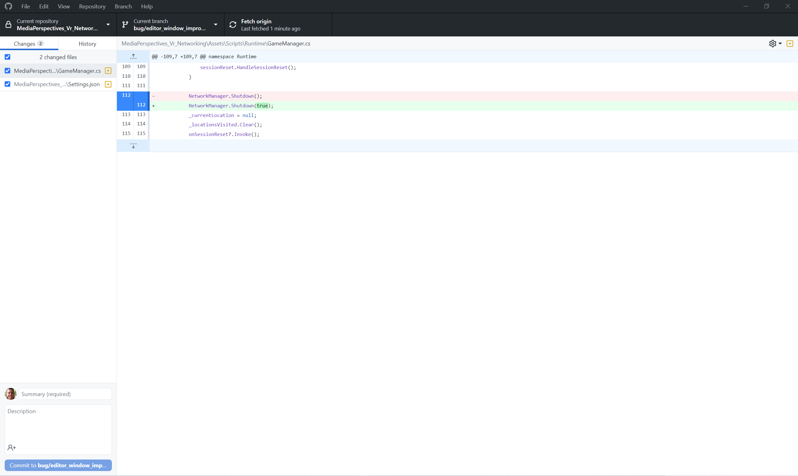
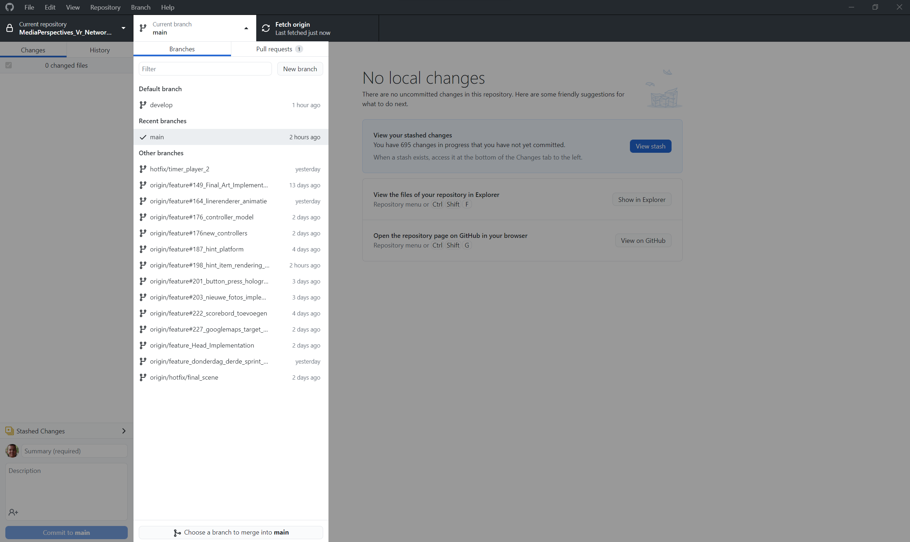
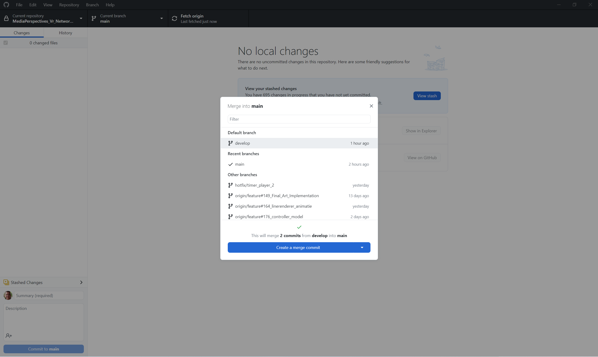

# workflow

Om op een overzichtelijke en efficiente manier samen te werken is het fijn om wat 'regels' af te spreken in hoe we samenwerken en dingen opleveren. De styleguide beschrijft al voor een groot gedeelte hoe je je werk moet oplevern. Maar hoe ga je te werk als je start met een nieuwe todo, of juist klaar bent. 

### Werken aan een asset

Wanneer je aan een asset gaat werken is het belangerijk dat de asset up-to-date is met de versie op git. Dit kan je doen via de command line 
```
git fetch
git pull
git merge develop
```

of er kan een external tool zoals github desktop gebruikt worden.

Fetch de laatste changes van git



Merge een branch in jou feature branch



Merge de target branch in jou branch. dit is gewoonlijk de branch Develop.




### Mijn taak is klaar wat nu
Indien je klaar bent met je taak kan je een pull request maken. In de pull requests zal een andere developer jou code controlleren op de juiste conventies. Eventueel kan je feedback krijgen op bepaalde naming van je files, methode's of class names. Als je geen feedback krijgt en de pull request is goedgekeurd kan hij gemerged worden.
Check altijd voor het merge of je de laatste versie van develop hebt. 

### Tips
- Fetch en merge aan het begin van de dag de laatste versie changes van git/develop. Zo verminder je merge problemen en zorg je dat je altijd in de laatste versie werkt.